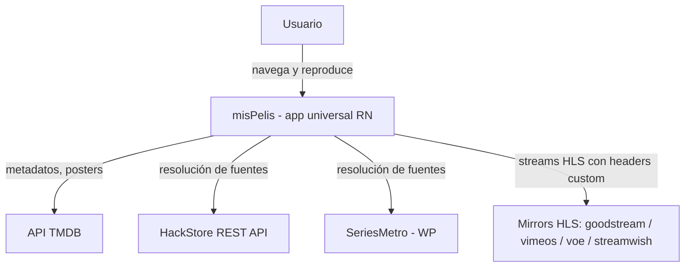
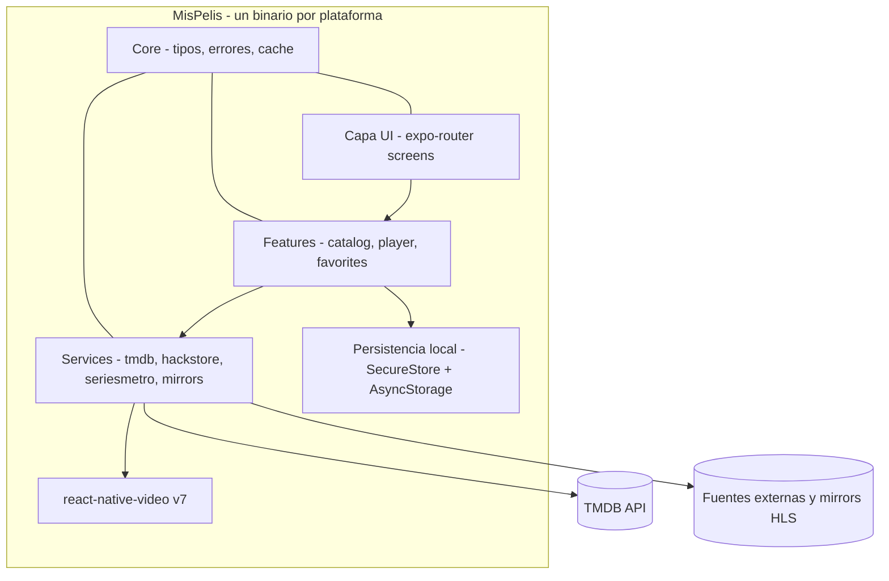

# ARCHITECTURE.md — misPelis (app universal)

> Estado: v1.0 · Fecha: 2026-09-05 · Regido por los ADRs en `docs/adr/`

## 1. Contexto y objetivos

Aplicación multiplataforma para descubrir y reproducir películas y series
(catalogadas en TMDB) con fuentes de video en español latino. Debe correr en
**iOS, iPadOS y Android (MVP)** y **macOS (fase 2, vía React Native para macOS)**.

Antecedente: existe una app anterior (`misPelis/`, Next.js + Electron + Playwright)
que solo corre en macOS. **No se migra su código: sirve únicamente como
referencia de lógica** (resolvers de mirrors, API de HackStore, navegación de
SeriesMetro). Quedará como carpeta de solo lectura hasta su eliminación.

### Restricciones

- **Sin backend propio.** Toda la lógica (TMDB, HackStore, SeriesMetro,
  resolvers de mirrors) vive dentro de la app. Verificado que estas fuentes se
  resuelven con HTTP puro (ver ADR-0002).
- **Sin scraping.** Playwright/Chromium quedan fuera del stack (ADR-0002).
- El reproductor nativo envía headers HTTP custom (`Referer`, `Origin`,
  `User-Agent`) exigidos por los mirrors — no se necesita proxy HLS (ADR-0003).
- **Responsabilidad única** en todos los módulos: archivos pequeños, una sola
  razón de cambio por archivo (ADR-0004).
- Token TMDB embebido en el cliente (API pública de lectura) — supuesto aceptado.

## 2. Stack tecnológico (verificado con Context7)

| Tecnología | Versión | Justificación |
|---|---|---|
| Expo SDK | 56 | Router file-based, toolchain unificada iOS/Android |
| React Native | 0.85 (SDK 56) | Runtime nativo |
| React | 19.2.3 (SDK 56) | Modelo de UI conocido (procede de React 19 en misPelis) |
| expo-router | incluido en SDK 56 | Navegación file-based equivalente a Next.js App Router |
| react-native-video | v7 | HLS nativo + **headers custom por fuente** + subtítulos VTT side-car (ADR-0003) |
| expo-secure-store | SDK 56 | Token TMDB en Keychain/Keystore |
| @react-native-async-storage/async-storage | latest | Favoritos y continuo viendo (no sensible) |
| TypeScript | ≥ 5 | Contratos tipados entre capas |

Requisitos de build: Node ≥ 20.19, Xcode ≥ 26.4 (iOS 16.4+), Android SDK 36.

## 3. C4 — Contexto



## 4. C4 — Contenedores



## 5. Estructura de carpetas y reglas de dependencia

```
AZ-MisPelis/
├── ARCHITECTURE.md
├── docs/adr/                      # decisiones (ver listado abajo)
├── app/                           # SOLO pantallas y layouts (expo-router)
│   ├── _layout.tsx
│   ├── index.tsx                  # home
│   ├── search.tsx
│   ├── movie/[id].tsx
│   ├── tv/[id].tsx
│   └── favorites.tsx
├── features/                      # casos de uso de UI
│   ├── catalog/                   # grids, tarjetas, paginación TMDB
│   │   ├── components/
│   │   └── hooks/
│   ├── player/                    # reproducción y selección de fuente
│   │   ├── components/
│   │   ├── hooks/
│   │   └── source-picker/         # orden por idioma/calidad
│   └── favorites/                 # favoritos + continuar viendo
├── services/                      # I/O externo y transformación — sin UI
│   ├── tmdb/
│   │   ├── client.ts              # fetch base + token (SecureStore/.env)
│   │   ├── catalog.ts             # trending, discover, géneros
│   │   └── detail.ts              # movie/tv detail + títulos multi-idioma
│   ├── hackstore/
│   │   ├── api.ts                 # /api/rest/single y /player
│   │   ├── slug.ts                # slugs desde TMDB
│   │   └── source-mapper.ts       # embed → LatinoSource
│   ├── seriesmetro/
│   │   ├── page-fetch.ts          # HTML de película/serie
│   │   ├── episodes.ts            # admin-ajax: temporada/episodio
│   │   ├── embed-extract.ts       # regex trembed/iframe fastream
│   │   └── source-mapper.ts
│   ├── mirrors/                   # un archivo por mirror
│   │   ├── index.ts               # registro dispatch por dominio
│   │   ├── goodstream.ts
│   │   ├── vimeos.ts
│   │   ├── voe.ts
│   │   ├── streamwish.ts
│   │   └── decoders/
│   │       ├── voe-decode.ts
│   │       └── packed-js.ts       # unpackPacked
│   └── streams/
│       ├── types.ts               # StreamInput, StreamSource
│       ├── resolver.ts            # orquestador providers → fuentes
│       ├── quality.ts             # qualityFromUrl / detectQuality
│       └── cache.ts               # TTL 3h en memoria
├── core/                          # tipos compartidos, errores, base64 utils
│   ├── types/
│   ├── errors.ts
│   └── base64.ts                  # reemplazo de Buffer (runtime móvil)
├── lib/                           # utilidades UI genéricas (poco aquí)
└── app.json / tsconfig.json / package.json
```

### Reglas de dependencia (unidireccionales)

```
app/ → features/ → services/ → core/
```

- `app/` contiene solo navegación y composición de screens. No llama a `services/` directamente.
- `features/` orquesta casos de uso; conoce `services/` y `core/`.
- `services/` no importa de `features/` ni de `app/`; expone funciones puras de E/S.
- Un archivo = una responsabilidad (una clase/función exportada principal). Prohibido `utils.ts` genérico.
- Nunca importar entre providers (hackstore no conoce seriesmetro); el orquestador único es `services/streams/resolver.ts`.

## 6. Contratos globales (en `core/types`)

```ts
// StreamInput — igual que en misPelis (referencia)
interface StreamInput { type: "movie" | "tv"; id: number; season?: number; episode?: number }

// StreamSource — contrato único de salida de services/
interface StreamSource {
  key: string;                 // identificador estable de la fuente
  url: string;                 // m3u8 master
  headers: Record<string, string>;  // para react-native-video
  provider: "hackstore" | "seriesmetro";
  mirror: string;              // goodstream | vimeos | voe | streamwish | ...
  language: "Latino" | "Español" | "Subtitulado" | "Inglés";
  quality: string;             // "1080p" | "720p" | "auto" | ...
}
```

- Comunicación entre capas: **funciones async + tipos de `core/types`**. Sin eventos globales ni singletons mutables (la caché con TTL es el único estado de módulo permitido, en `services/streams/cache.ts`).
- Errores: clase `AppError { code, cause }` en `core/errors.ts`; cada `service` traduce sus fallos a `AppError` (ej. `SOURCE_NOT_FOUND`, `MIRROR_UNRESOLVED`). Nada de `throw new Error(...)` crudo hacia features.
- Configuración: variables de entorno vía `EXPO_PUBLIC_*` (token TMDB) persistidas después en SecureStore en primer arranque.

## 7. Persistencia

| Dato | Almacenamiento | Nota |
|---|---|---|
| Token TMDB | `expo-secure-store` | Escrito en primer arranque desde env |
| Favoritos / continuar viendo | AsyncStorage (JSON, versión de esquema incluida) | Local por dispositivo |

## 8. Reproducción (contrato con el player)

`features/player` recibe un `StreamSource` y lo mapea a `react-native-video` v7:

```tsx
useVideoPlayer({
  uri: source.url,
  headers: source.headers,           // soporte nativo verificado
  externalSubtitles: subtitles.map(s => ({ uri: s.url, label: s.label, type: 'vtt', language: s.lang })),
  bufferConfig: { minBufferMs: 5000, maxBufferMs: 30000, bufferForPlaybackMs: 2000 },
});
```

Selección de fuente: preferencia de idioma (Latino > Español > Subtitulado) y calidad (1080p > 720p > resto), con cambio manual en un picker — vive en `features/player/source-picker/`.

## 9. Testing

- **Unit (vitest):** decoders de mirrors (`voe-decode`, `packed-js`), `quality.ts`, `slug.ts`, `embed-extract.ts` — lógica pura, sin red.
- **Integración (unit + fixtures):** resolvers de mirrors y mappers contra HTML/JSON guardados en `__fixtures__/` (sin llamadas reales en CI).
- **E2E (opcional, fase posterior):** Maestro/Detox sobre flujos críticos (buscar → reproducir).
- Regla: cada `services/*` debe ser testeable sin dispositivo.

## 10. Seguridad

- Token TMDB en SecureStore (no en AsyncStorage, no hardcodeado en código fuente de release).
- Los mirrors son terceros no confiables: el app solo consume m3u8/VTT; nunca se ejecuta código de sus respuestas (los decoders son transformaciones de texto, no `eval`).
- Sin telemetría hacia terceros en MVP.

## 11. Observabilidad

- MVP: logs estructurados locales (`core/logger.ts`) con niveles, y reporte de errores por `AppError.code`.
- Fase 2: Sentry (compat RN) para crashes; decisión pendiente (pregunta abierta).

## 12. Despliegue

- iOS/iPadOS: EAS Build → TestFlight → App Store (requiere cuenta Apple Developer).
- Android: EAS Build → APK interno / Play Store.
- Fase 2 (macOS): `react-native-macos` con build local, fuera de App Store inicialmente (ver ADR-0005).
- Updates OTA: expo-updates para fixes de JS sin re-publicar tiendas.

## 13. Guía para Plan (descomposición en tareas)

1. Scaffolding Expo SDK 56 + TypeScript + ESLint + estructura de carpetas (secciones 5 y 6).
2. `core/` (tipos, errores, base64) + contratos `StreamSource`.
3. `services/tmdb/` con fixtures.
4. `services/hackstore/` (api → slug → mapper) con fixtures.
5. `services/seriesmetro/` (page → episodes → embed → mapper) con fixtures.
6. `services/mirrors/` (un resolver por PR) + decoders.
7. `services/streams/resolver.ts` + caché TTL + priorización.
8. `features/player/` con react-native-video + source-picker.
9. Screens de `app/` (home, search, movie, tv, favorites) + navegación.
10. Persistencia (favoritos/continuar viendo) + ajustes.
11. Builds EAS internos (iOS/Android).

Cada tarea 4–7 puede completarse y probarse contra fixtures de forma independiente (beneficio de la SRP).

## 14. Guía para Build

- Respeta estrictamente las reglas de dependencia (sección 5). Si una feature necesita algo de otro provider, el orquestador `resolver.ts` debe absorberlo — nunca un import cruzado.
- Antes de portar código desde `misPelis/`, lee el archivo de referencia pero escribe el módulo nuevo con su propia responsabilidad (no copies `latino.ts` monolítico: divídelo como indica la sección 5).
- No agregues dependencias sin ADR que las justifique.

## 15. Supuestos, riesgos y preguntas abiertas

**Supuestos**
- HackStore y SeriesMetro mantienen sus endpoints actuales estables (fragilidad inherente a terceros).
- Token TMDB público es aceptable embebido.

**Riesgos**
| Riesgo | Impacto | Mitigación |
|---|---|---|
| Cambio de HTML/API de fuentes | Resolución de fuentes rota | Decoders aislados por mirror + fixtures como tests de regresión |
| CDN de mirror cambia headers exigidos | Playback roto en un mirror | Headers por fuente en `StreamSource`; fallback al siguiente mirror |
| react-native-macos (fase 2) menos maduro | Retraso macOS | Phase 2 aislada; Android/iOS no dependen de ella |
| Revisión de App Store (contenido de terceros) | Rechazo | Riesgo aceptado por el propietario; binario sin scraping reduce superficie |

**Preguntas abiertas**
1. ¿Observabilidad con Sentry en fase 2 o nunca?
2. ¿Se necesita soporte de TV (Android TV / tvOS) algún día? (afecta player y navegación)
3. ¿Perfil/cuenta multi-dispositivo algún día? (hoy todo es local)
